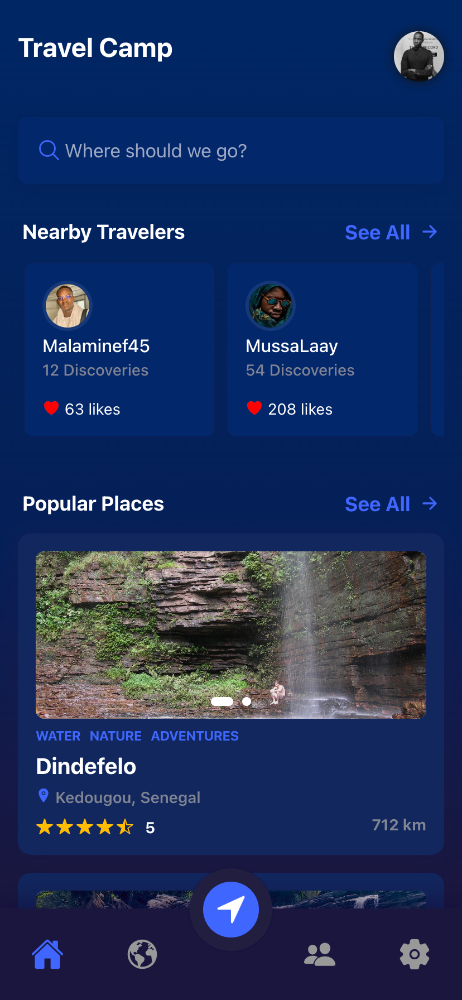
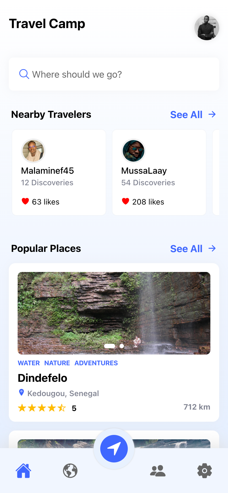

# Discovery

> An static Travel & Discovery App

### Included in this Ionic Vue Capacitor Template/UI

- Ionic 6 components
- Custom headers/toolbars
- Data fetching from local JSON
- Ionicons
- Swiper
- Vue-router
- Sass

### To run

```javascript
$ npm install
$ ionic serve
```

 

> You can add the iOS, Android platform and run natively.

# Lets connect on instagram [@thecodemaker12](https://www.instagram.com/thecodemaker12)
